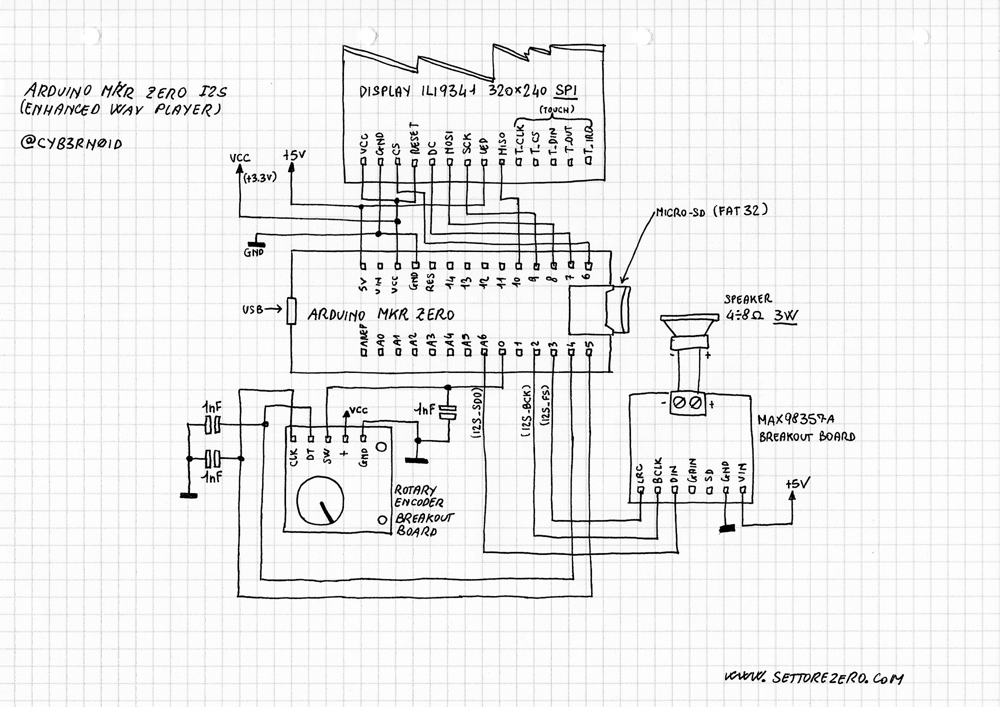
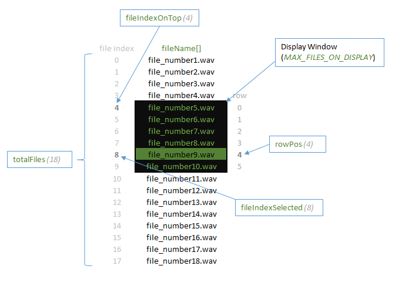

## Arduino MKR Zero I2S demo (Enhanced WAV Player)

This is a simple WAV Player Demo: an enhanced version of the standard _Arduino Sound_ example. This demo will not output on serial port but on a Display, and you can use a rotary encoder for selecting WAV file you want to play and adjust the volume.  
  
You need a FAT32 formatted microSD card. You can load on the microSD WAV files (44KHz 16bit stereo) and also TXT files having the same name of the wav: the TXT content will be rendered on the display while WAV file is playing

### Schematic

### Libraries to be installed

- Adafruit ILI9341
- Adafruit GFX
- Arduino Sound

### Materials needed

- Arduino MKR Zero
- ILI9341 320x240 SPI Display (touch screen and SD card reader are not needed, so you can choose a cheaper model)
- Rotary Encoder breakout board
- MAX98357A breakout board

### Menu working
Since someone asked me explainings about how I've done the menu system, I made a simple schematic about how menu works:

